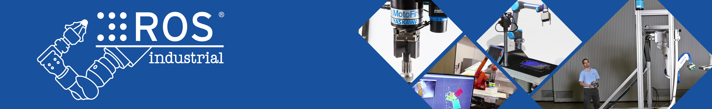

[](https://rosindustrial.org/)
# Interactive Tutorials for ROS-Industrial

## Concepts and Fundamentals
* [Nodes, Topics, Services, and Parameters](Concepts/Fundamentals/index.ipynb)
* [Publisher and Subscriber in Python](Concepts/Topics/index.ipynb)

## Basic Applications
* [Server and Client in Python](Applications/Services/index.ipynb)
* [Simple Action Server and Client in Python](Applications/Actions/index.ipynb)

## Transform Library
* [Introduction to tf](Transform/Intro/index.ipynb)
* [Broadcaster and Listener in Python](Transform/Programming/index.ipynb)

<hr>

### Usage

1. Install [docker](https://www.docker.com/)

2. Clone this repository in your computer

3. Build the docker image:
```docker build -f roslab.dockerfile -t rosin-tutorials .```

4. Run the docker image:
```docker run --rm -p 8888:8888 rosin-tutorials```

5. Open this URL in your browser:
[http://localhost:8888/lab/tree/README.ipynb](http://localhost:8888/lab/tree/README.ipynb)

Tested on:
* Windows 10 Education and Docker Desktop 2.0.0.3 (engine: 18.09.2)
* macOS Mojave 10.14.4 and Docker Desktop 2.0.0.3 (engine: 18.09.2)
* Ubuntu Linux 16.04.6 and Docker 18.06.1-ce

You can also try these tutorials in Binder:

[](https://mybinder.org/v2/gh/RobInLabUJI/ROSIN-Tutorials/master?urlpath=lab/tree/README.ipynb)

<hr>

### Licensing

This work, "Interactive Tutorials for ROS-Industrial", is a derivative of "[ROS Tutorials](http://wiki.ros.org/ROS/Tutorials)" by the [Open Source Robotics Foundation](http://www.osrfoundation.org/), used under [CC BY](https://creativecommons.org/licenses/by/3.0/), and "[ROS-Industrial Training Material](http://ros-industrial.github.io/industrial_training/index.html)" by the [ROS-Industrial Consortium](http://rosindustrial.org/ric), used under an [Apache License 2.0](https://www.apache.org/licenses/LICENSE-2.0).

<a href="http://robinlab.uji.es"></a>
"Interactive Tutorials for ROS-Industrial" is licensed under an [Apache License 2.0](https://www.apache.org/licenses/LICENSE-2.0) by the [Robotic Intelligence Lab](http://robinlab.uji.es) of [Jaume-I University (Castelló, Spain)](http://www.uji.es).

<hr>

<a href="http://rosin-project.eu"></a>

This work is funded by [ROSIN Education Projects](http://rosin-project.eu/eps),
which has received funding from the European Union's Horizon 2020 research and innovation programme under grant agreement No 732287. The opinions expressed on this website reflect only the author's view, and in no way the European Commission's opinions.
The European Commission is not responsible for any use that may be made of the information it contains.
